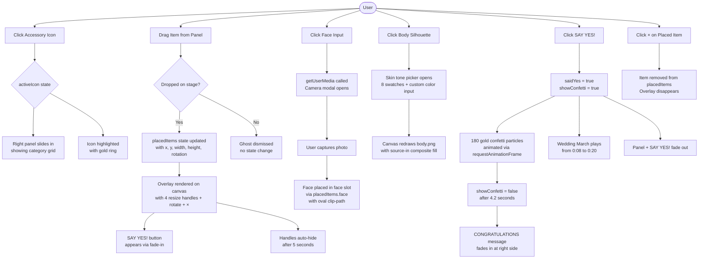

# Say Yes to the Dress — Fitting Room

**AI 201 · Project 1 · Bruna Stefani**
**Live URL:** https://brunastefani.github.io/CharacterSelectionScreen/

---

## Design Intent

My design intent was authored in Figma before any code was written. The full visual spec — color palette, typography, component layout, hover states, and interaction rules — lives in the Figma file:

**Figma file:** [AI-Projects-Design-File — node 10:318](https://www.figma.com/design/fTcwDkIUW4nyXE57DU8HQI/AI-Projects-Design-File?node-id=10-318)

**Summary of rules locked before AI engagement:**

- **Color palette:** Warm cream gradient background (`#f1f1f1 → #f9f7f1`), gold accents (`#c8a97e`, `#D3A550`), white panels
- **Typography:** KyivType Sans throughout — 70px title, 50px subtitle, 26px CTA. No substitutions.
- **Layout:** Fixed 1920×1080 canvas scaled via `transform: scale()` — all Figma coordinates used as-is
- **Interaction rules:** Drag-and-drop to try on items (not click-to-place). Items placed as floating overlays with drag, resize, rotate, and × remove controls. Handles auto-hide after 5 seconds.
- **Mood:** Bridal editorial — warm, elegant, unhurried. Nothing fast or jarring.
- **Non-negotiables:** The body silhouette stays centered on the podium. The drag ghost must be visible. Handles must not cover the dress image.

---

## Mermaid Diagram

System flow: what receives input, how it processes, what it outputs.



---

## AI Direction Log

| # | What I Asked AI to Do | What AI Produced | What I Kept / Changed / Rejected — and Why |
|---|---|---|---|
| 1 | Set up the full Vite + React project scaffold, GitHub Actions deploy pipeline, and directory structure before any creative work | A proposed directory tree including a `docs/` folder at repo root and a `public/` folder for assets | Rejected both — kept docs inside `claude/docs/` only, moved assets to `src/assets/`. Approved the rest and had AI build it manually after `npm create vite` failed repeatedly due to interactive prompt conflicts |
| 2 | Implement the full Fitting Room screen from Figma (node `10:318`) — background, podium, wheel, body, accessory icons, right panel with dress grid | Full component with layout matching Figma, but drag-and-drop replaced with click-to-place overlay on the body silhouette | Rejected the click-to-place approach entirely. Directed AI to revert and rebuild with drag-from-panel → drop-on-stage interaction, ghost cursor, floating overlay with handles |
| 3 | Add drag, resize, rotate, and × controls to the captured face photo | Placed the face photo into the `placedItems` system — but image appeared as a square outside the face input area, handles were invisible, × button not visible | Rejected and reverted. Root cause: `overflow: hidden` on the container was clipping handles positioned outside the div, and the container was too small. Redirected to use `clip-path: ellipse(50% 50%)` on the `` only — not the container — so handles render outside the element bounds unobstructed |
| 4 | Change the body silhouette color using a CSS color overlay when the user clicks on it | Applied `mix-blend-mode: color` overlay div inside `.fr-body` — colored the entire bounding rectangle, including transparent areas around the silhouette | Rejected. Directed AI to switch to a canvas-based approach: draw `body.png` to a `<canvas>`, then use `globalCompositeOperation: 'source-in'` to fill only the opaque silhouette pixels with the chosen color |
| 5 | Position the skin tone color picker panel at the exact location specified in the Figma design | First attempt: placed it at `left: 1092px, top: 723px` from an earlier `get_design_context` call. Second attempt after user said "check the file again": fetched `get_metadata` which returned the current coordinates `x: 1088, y: 683` | Kept the second result — `get_metadata` was more reliable than `get_design_context` for exact current coordinates when the node had been repositioned in Figma |

---

## Records of Resistance

| # | What AI Produced | Why I Rejected It | What I Did Instead |
|---|---|---|---|
| 1 | Rewrote the component to replace the body silhouette on click — removed all drag-and-drop code, the ghost cursor, handles, and resize/rotate logic entirely | The interaction concept was wrong. Clicking is too passive for a try-on experience; drag-and-drop is the intended UX because it mimics physically placing a dress on a body. The whole emotional arc of the feature was lost. | Directed AI to fully revert `FittingRoom.jsx` and `FittingRoom.css` to the drag-and-drop version. Stated explicitly that the interaction model was non-negotiable. |
| 2 | When positioning the congratulations text from Figma, also changed the font from KyivType Sans to Inter Bold without being asked | I never requested a font change. KyivType Sans is a locked rule in my Design Intent — it's the typeface that gives the screen its bridal editorial tone. Swapping it to Inter would make it look generic. | Reverted the font to KyivType Sans 400. Established a rule going forward: AI must explicitly confirm any unrequested changes to font, color, weight, or size before committing. |
| 3 | Used a `mix-blend-mode: color` overlay div inside `.fr-body` to tint the body silhouette color | The blend mode colored the entire bounding box rectangle — including the transparent areas around the silhouette shape. The result was a colored rectangle, not a colored body. It looked broken. | Directed AI to use a `<canvas>` element with `globalCompositeOperation: 'source-in'` — which fills only the opaque pixels of the PNG, leaving transparent areas untouched. This is the correct technique for tinting silhouettes. |

---

## Five Questions Reflection

**1. Can I defend this? Can I explain every major decision in this project?**
Yes, I can clearly explain and justify every major decision made throughout the project.

**2. Is this mine? Does this reflect my creative direction, or did I mostly follow AI's suggestions?**
Yes, this work is fully mine. I defined the creative direction and designed the experience intentionally in Figma before using AI. The AI supported execution, but the vision and decisions were driven by me.

**3. Did I verify? Did I check that things work the way I think they work?**
Yes, I tested each interaction as soon as it was generated to ensure it worked as intended. I evaluated whether to keep, refine, or redo elements to maintain a high-quality, functional interface.

**4. Would I teach this? Do I understand it well enough to explain it to someone else?**
Yes, I understand the process and decisions deeply enough to confidently explain and teach it to others.

**5. Is my documentation honest? Does my AI Direction Log accurately describe what I asked and what I changed?**
Yes, my documentation is accurate and transparent, clearly reflecting both my prompts and the iterations I made.

---

## How to Run Locally

```bash
npm install
npm run dev
# → http://localhost:5173/CharacterSelectionScreen/
```
